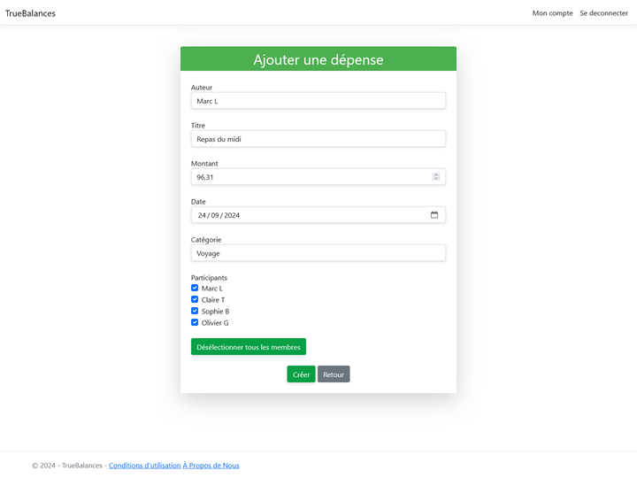
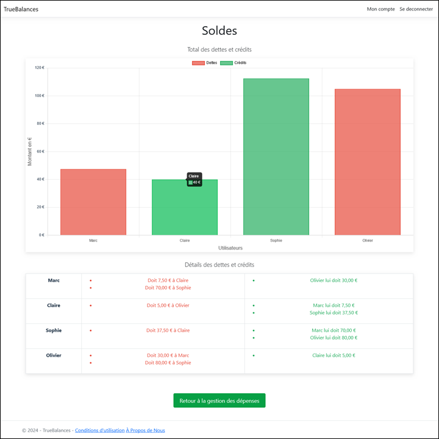

# TrueBalances

\
*Exemple d'une vue de la page d'acceuil*

## Sommaire

- [À propos](#a-propos)
- [Technologies et environement utilisées](#technologies-et-environement-utilisees)
- [Contributeurs](#contributeurs)

## À propos

Truebalances est une application web conçue pour simplifier la gestion des dépenses partagées entre amis, colocataires ou collègues, lors des voyages, repas ou autres projets de groupe.

\
*Exemple d'une vue montrant la saisie d'une dépense*

L'application permet, une fois que l'on s'est enregistré et authentifié, de saisir des dépenses. La liste de ces dépenses, ainsi que les listes des participants associées à chacune d'entre elles, permet de calculer les dettes que les utilisateurs ont les uns envers les autres.

\
*Exemple d'une vue récapitulant les dettes de chacun*

Ces calculs sont faits automatiquement, ce qui permet de gagner du temps et d'éviter les malentendus, le tout en gardant l'ensemble des informations organisées et transparentes.

## Technologies et environement utilisées

- C# .NET Core 8
- ASP.NET MVC
- Entity Framework
- Identity Razor class library
- SQL SERVER database

### Contributeurs

- [Edouard](https://github.com/Djibrildaniels)
- [Khaoula](https://github.com/khoulaagzenay)
- [Anthony](https://github.com/abt-111)