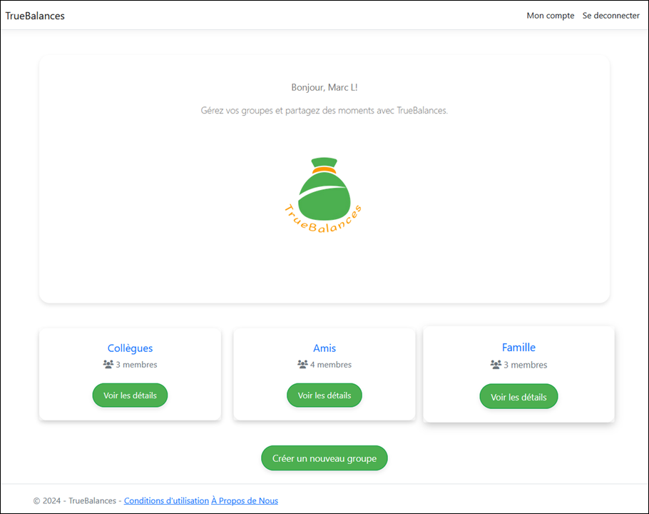

# TrueBalances

## Sommaire

- [À propos](#a-propos)
  - [Exemple d'une vue de la page d'accueil](#exemple-dune-vue-de-la-page-daccueil)
- [Technologies et environement utilisées](#technologies-et-environement-utilisees)
- [Contributeurs](#contributeurs)

## À propos

Truebalance est une application web conçue pour simplifier la gestion des dépenses partagées entre amis, colocataires ou collègues. 

Elle permet de suivre facilement qui doit combien à qui, en calculant automatiquement les dettes de chacun, ce qui permet d'éviter les malentendus financiers en gardant tout organisé et transparent.

Elle est particulièrement utile pour les voyages, les repas ou les projets en groupe.

### Exemple d'une vue de la page d'accueil

## Technologies et environement utilisées

- C# .NET Core 8
- ASP.NET MVC
- Entity Framework
- Identity Razor class library
- SQL SERVER database

### Contributeurs

- [Edouard](https://github.com/Djibrildaniels)
- [Khaoula](https://github.com/khoulaagzenay)
- [Anthony](https://github.com/abt-111)